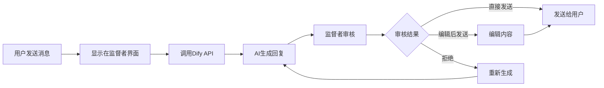

# 项目总结与实施建议

## 项目概述

我们已经为您的人工监督AI客服系统demo制定了完整的架构设计和实施方案。这个系统将实现以下核心功能：

### 🎯 核心特性
- **双视角界面**: 用户视角和监督者视角的并行对话栏
- **智能审核流程**: AI回复先经监督者审核再发送给用户
- **实时状态同步**: "正在输入"状态和消息状态实时更新
- **灵活编辑功能**: 监督者可直接发送或编辑后发送AI回复
- **Dify API集成**: 无缝对接您现有的AI服务

## 📋 完整实施计划

### 阶段一：基础架构 (预计2-3小时)
1. **项目初始化和环境配置** - 创建项目结构，安装依赖
2. **设计Streamlit双栏布局界面** - 实现左右分栏的基础布局
3. **实现消息状态管理系统** - 核心的状态管理和数据流

### 阶段二：核心功能 (预计3-4小时)
4. **实现用户对话栏组件** - 用户视角的聊天界面
5. **实现监督者对话栏组件** - 监督者的审核界面
6. **集成Dify API调用功能** - 连接您的AI服务
7. **实现"正在输入"状态显示** - 用户体验优化

### 阶段三：高级功能 (预计2-3小时)
8. **实现监督者审核和编辑功能** - 核心的审核工作流
9. **实现消息发送确认机制** - 确保消息正确传递
10. **添加会话历史记录功能** - 完整的对话记录

### 阶段四：完善优化 (预计1-2小时)
11. **进行界面美化和用户体验优化** - 提升视觉效果
12. **测试完整的工作流程** - 端到端测试
13. **创建使用说明文档** - 用户手册和部署指南

## 🏗️ 技术架构亮点

### 1. 模块化设计
```
ai_customer_service/
├── app.py                 # 主应用入口
├── components/            # UI组件模块
├── services/             # 业务服务模块
├── utils/                # 工具函数模块
└── config/               # 配置管理模块
```

### 2. 状态管理策略
- 使用Streamlit Session State管理应用状态
- 实现消息状态的完整生命周期管理
- 支持并发用户和状态隔离

### 3. API集成方案
- 异步调用Dify API提高响应速度
- 完善的错误处理和重试机制
- 支持流式响应和批量处理

### 4. 用户体验设计
- 直观的双栏对话界面
- 实时的状态反馈和进度指示
- 流畅的消息流动和交互体验

## 🔧 关键技术实现

### 消息流程控制


### 状态同步机制
- **用户状态**: 显示"正在输入"直到收到最终回复
- **监督者状态**: 实时显示待审核消息和编辑界面
- **系统状态**: 维护完整的对话历史和会话上下文

## 📊 预期效果

### 用户体验
- ✅ 用户感受到的是标准的客服对话体验
- ✅ 响应时间合理（包含人工审核时间）
- ✅ 回复质量高（经过人工监督）

### 监督者体验
- ✅ 清晰的审核界面和操作流程
- ✅ 高效的编辑和确认机制
- ✅ 完整的对话上下文和历史记录

### 系统特性
- ✅ 稳定的API集成和错误处理
- ✅ 良好的性能和响应速度
- ✅ 易于部署和维护

## 🚀 部署和扩展

### 快速部署 (使用Pixi)
```bash
# 1. 初始化项目
pixi init ai_customer_service
cd ai_customer_service

# 2. 添加依赖
pixi add streamlit requests python-dotenv
pixi add --feature dev pytest black flake8 mypy

# 3. 配置环境变量
cp .env.example .env
# 编辑.env文件，添加您的Dify API密钥

# 4. 启动应用
pixi run dev  # 开发环境
pixi run start  # 生产环境
```

### Pixi配置文件 (pixi.toml)
```toml
[project]
name = "ai_customer_service"
version = "0.1.0"
description = "人在回路自动营销系统"
channels = ["conda-forge", "pola-rs"]
platforms = ["win-64", "linux-64", "osx-64", "osx-arm64"]

[dependencies]
python = ">=3.9,<3.12"
streamlit = ">=1.28.0"
requests = ">=2.31.0"
python-dotenv = ">=1.0.0"

[feature.dev.dependencies]
pytest = "*"
black = "*"
flake8 = "*"
mypy = "*"

[tasks]
start = "streamlit run app.py --server.port 8501 --server.address 0.0.0.0"
dev = "streamlit run app.py --server.port 8501"
test = "pytest tests/"
format = "black ."
lint = "flake8 ."
typecheck = "mypy ."
```

### 扩展可能性
- **多监督者支持**: 支持多个监督者并行工作
- **权限管理**: 不同级别的监督者权限控制
- **统计分析**: 监督效果和AI回复质量分析
- **模板管理**: 常用回复模板和快捷操作
- **集成其他AI服务**: 支持多种AI服务提供商

## 💡 实施建议

### 1. 开发优先级
建议按照todo列表的顺序逐步实施，先完成核心功能，再添加高级特性。

### 2. 测试策略
- 在每个阶段完成后进行功能测试
- 重点测试API集成和状态同步
- 进行用户体验测试和界面优化

### 3. 部署准备
- 准备好Dify API的访问凭证
- 确保网络环境支持API调用
- 考虑生产环境的性能和安全需求

### 4. 后续优化
- 收集用户反馈进行界面优化
- 监控系统性能和API调用情况
- 根据实际使用情况调整功能设计

## 📝 下一步行动

1. **确认技术方案**: 审查架构设计和技术实现方案
2. **准备开发环境**: 设置Python环境和必要的工具
3. **获取API凭证**: 准备Dify API的访问密钥和配置
4. **开始实施**: 按照todo列表逐步开发功能
5. **测试验证**: 在每个阶段进行充分的测试

这个完整的方案为您的人在回路自动营销系统提供了清晰的实施路径和技术保障，确保项目能够成功交付并满足您的需求。