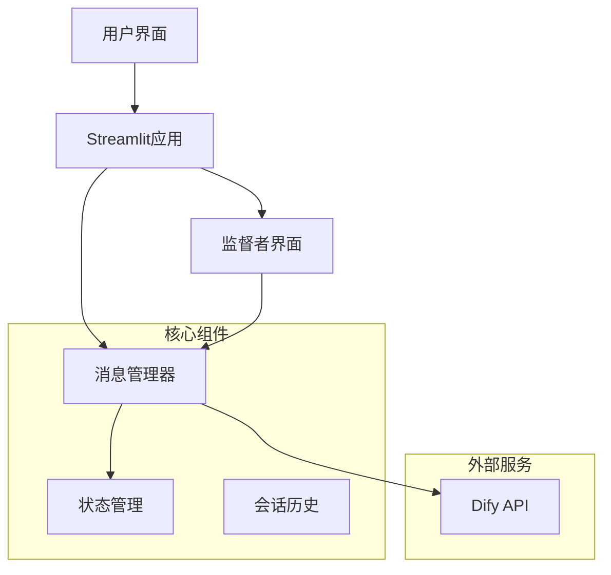
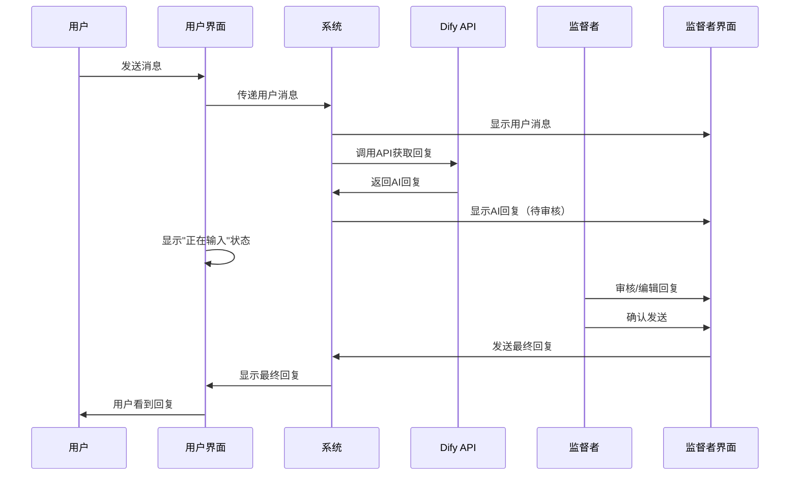

# 人工监督AI客服系统 - 系统架构设计

## 项目概述

本项目旨在创建一个人工监督的AI客服系统demo，通过双视角界面实现AI回复的人工审核机制，确保客服质量。

## 系统架构



## 技术栈

- **前端框架**: Streamlit
- **AI服务**: Dify API
- **状态管理**: Streamlit Session State
- **数据存储**: 内存存储（demo版本）
- **编程语言**: Python

## 核心功能模块

### 1. 双栏界面设计
- **左栏**: 用户视角对话界面
- **右栏**: 监督者视角对话界面
- **响应式布局**: 适配不同屏幕尺寸

### 2. 消息流程管理



### 3. 状态管理系统

#### 消息状态
- `pending`: 等待AI回复
- `ai_generated`: AI已生成回复，等待监督者审核
- `under_review`: 监督者正在审核/编辑
- `approved`: 监督者已确认，发送给用户
- `sent`: 用户已收到消息

#### 会话状态
- `user_messages`: 用户消息历史
- `supervisor_messages`: 监督者消息历史
- `pending_reviews`: 待审核消息队列
- `typing_status`: 输入状态标识

## 界面设计规范

### 用户视角界面
- **简洁设计**: 标准聊天界面
- **状态指示**: "正在输入..."提示
- **消息气泡**: 区分用户和客服消息
- **时间戳**: 显示消息发送时间

### 监督者视角界面
- **消息预览**: 显示AI生成的原始回复
- **编辑功能**: 可修改AI回复内容
- **操作按钮**: "直接发送"、"编辑后发送"、"拒绝"
- **用户消息**: 显示用户的完整对话历史

## API集成方案

### Dify API调用
```python
# API调用示例结构
def call_dify_api(user_message, conversation_id=None):
    headers = {
        'Authorization': f'Bearer {API_KEY}',
        'Content-Type': 'application/json'
    }
    
    payload = {
        'inputs': {},
        'query': user_message,
        'response_mode': 'blocking',
        'conversation_id': conversation_id,
        'user': 'user_id'
    }
    
    response = requests.post(API_ENDPOINT, headers=headers, json=payload)
    return response.json()
```

## 数据结构设计

### 消息对象
```python
class Message:
    id: str
    content: str
    sender: str  # 'user' | 'ai' | 'supervisor'
    timestamp: datetime
    status: str
    original_ai_response: str  # 原始AI回复
    edited_response: str       # 编辑后的回复
```

### 会话对象
```python
class Conversation:
    id: str
    messages: List[Message]
    status: str
    created_at: datetime
    last_activity: datetime
```

## 安全考虑

1. **API密钥管理**: 使用环境变量存储敏感信息
2. **输入验证**: 对用户输入进行清理和验证
3. **错误处理**: 优雅处理API调用失败等异常情况
4. **日志记录**: 记录关键操作和错误信息

## 性能优化

1. **异步处理**: 使用异步调用提高响应速度
2. **缓存机制**: 缓存常见问题的回复
3. **状态持久化**: 保存会话状态防止数据丢失
4. **资源管理**: 合理管理内存和API调用频率

## 扩展性考虑

1. **多监督者支持**: 支持多个监督者同时工作
2. **权限管理**: 不同级别的监督者权限
3. **统计分析**: 监督效果和AI回复质量分析
4. **模板回复**: 常用回复模板管理

## 部署方案

### 开发环境
- 本地Streamlit开发服务器
- 环境变量配置文件

### 生产环境
- Docker容器化部署
- 云服务器部署
- 负载均衡和高可用配置

## 测试策略

1. **单元测试**: 核心功能模块测试
2. **集成测试**: API调用和数据流测试
3. **用户体验测试**: 界面交互和流程测试
4. **性能测试**: 并发用户和响应时间测试

## 项目文件结构

```
ai_customer_service/
├── app.py                 # 主应用文件
├── components/
│   ├── user_chat.py      # 用户对话组件
│   ├── supervisor_chat.py # 监督者对话组件
│   └── message_manager.py # 消息管理器
├── services/
│   ├── dify_api.py       # Dify API集成
│   └── state_manager.py  # 状态管理
├── utils/
│   ├── helpers.py        # 工具函数
│   └── constants.py      # 常量定义
├── config/
│   └── settings.py       # 配置文件
├── requirements.txt      # 依赖包列表
├── .env.example         # 环境变量示例
└── README.md            # 项目说明
```

这个架构设计为项目的实施提供了清晰的指导方向，确保系统的可维护性、可扩展性和用户体验。